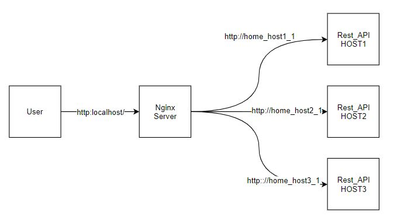
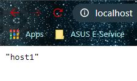
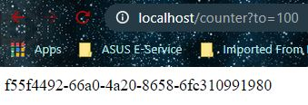
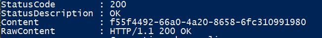
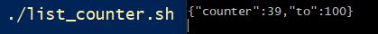

# Disclaimer
This code is not meant to be run in production but for experimental purpose.

# Counter API with its Supporting Infrastructure
This challenge was to implement a counter API with its supporting infrastructure.

The code should satisfy the following conditions:

1. Each task must be easily testable/verifiable, and produce results as described in the task's description.
2. All the code with the exception of shell scripts must run within Docker containers.
3. You are expected to write 2 types of code.
    1. Write application code for the REST-API server in Python or Go.
    2. Write shell scripts for each associatedd task, that facilitates the plumbing and testing.
4. Write test code taht covers all of your implementations as much as possbile.
5. Explain your design choices and instructions on how to start/ test your application in detail as much as possible.
6. Feel free to use services or libraries other than those suggested in the following steps.
    1. Dont use public services to run your application.
    2. Ideally, your application should run on a laptop without any paid services.
7. Submit an archive of the whole project directory (incluing the version control meta-data such as ".git directory")
8. Most implementation-specific details have been deliberately left out. Please briefly describe your design choices in a README.md

The subtasks are the following:
1. Write "setup_api.sh" which launches an Nginx reverse-proxy and spanwns a number of REST-API backend servers.
2. Create counter for REST-API servers.
3. Query all counters
4. Dynamically change the number of servers while the counter does not lose its data.
5. Implement a delete operation to delete the counter.

- [x] Task 1
- [x] Task 2
- [x] Task 3
- [] Task 4
- [x] Task 5

# Note
__This task is not fully completed and tested. Beware of running this project__

# Technologies
* Nginx
* Docker
* Flask

# Basic Diagram
The interpretation of the challenge is as follows:

If a user were to type the following: `./setup.sh 3` three REST-API servers are made

The `setup.sh` builds the nginx server and the REST_API servers written in Python with the Flask web framework. Flask was used because of its quick and easy deployment server.

# Running the Project

After running `./setup.sh 1`, build the docker containers by running `docker-compose build` and run `docker-compose run -d --remove-orphans`. `--remove-orphans` removes and remaining docker containers with the same name. 

# Task 1

If the docker containers are running. Open a web browser and type `http://localhost/`. This should redirect to the host server.

You can also run `./check_task1.sh`.

# Task 2

To post the counter limit, use `check_task2.sh args` and replace args with a positive value. When the post was successful. The app will generate a UUID which can be used to access the counter.

# Task 3

The script `./list_counter.sh` queries all the counters. 

# Task 4

Incomplete

# Task 5

To destroy all the counters, run `./check_task5.sh`. This script will reset the counter.
